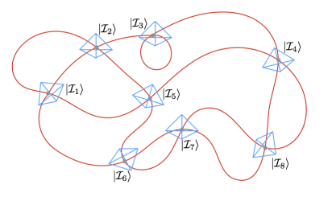

# Simulating-Loop-Quantum-Gravity-with-Quantum-Computation
Studying the emergence of spacetime from the Loop Quantum Gravity picture of Planck-scale physics using quantum computation. 

## Loop Quantum Gravity with PennyLane and Python

Czelusta, Grzegorz, and Jakub Mielczarek. "Quantum circuits for the Ising spin networks." arXiv preprint arXiv:2304.03559 (2023).
( https://arxiv.org/abs/2304.03559 )

## Quanatum Gravity with Quantum Computers

van der Meer, Reinier, Zichang Huang, Malaquias Correa Anguita, Dongxue Qu, Peter 
Hooijschuur, Hongguang Liu, Muxin Han, Jelmer J. Renema, and Lior Cohen. 
"Experimental simulation of loop quantum gravity on a photonic chip." npj 
Quantum Information 9, no. 1 (2023): 32. ( https://www.nature.com/articles/s41534-023-00702-y )

Data underlying the publication: Experimental Simulation of Loop Quantum Gravity on a 
Photonic Chip  ( https://data.4tu.nl/articles/dataset/Experimental_Simulation_of_Loop_Quantum_Gravity_on_a_Photonic_Chip/22117049 )

Prelude to Simulations of Loop Quantum Gravity on Adiabatic Quantum Computers ( https://www.frontiersin.org/articles/10.3389/fspas.2021.571282/full )

Efficient Simulation of Loop Quantum Gravity -- A Scalable Linear-Optical Approach ( https://arxiv.org/abs/2003.03414 )

Quantum Virtual Reality ( https://www.cs4fn.org/quantum/quantumuniverse.php )

Quantum Simulations of Loop Quantum Gravity ( https://arxiv.org/abs/2112.02426 )

## Wheeler-Dewitt Equation with PennyLane and Python

## Quantum Programming in Python with PennyLane

Arrazola, Juan Miguel, Soran Jahangiri, Alain Delgado, Jack Ceroni, Josh Izaac, Antal Száva, 
Utkarsh Azad et al. "Differentiable quantum computational chemistry with PennyLane." 
arXiv preprint arXiv:2111.09967 (2021). ( https://arxiv.org/abs/2111.09967 )
